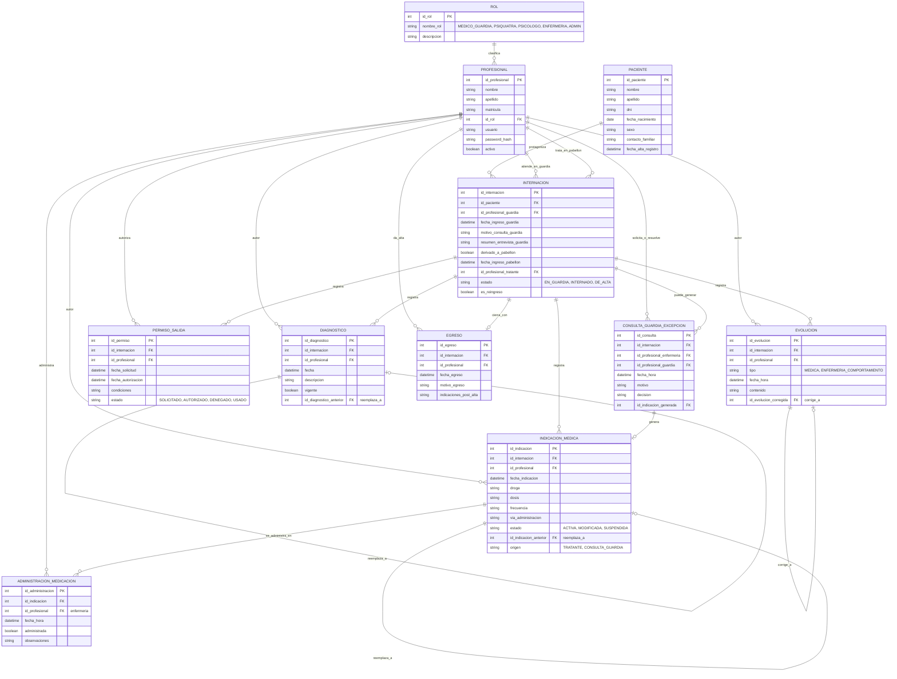

# Modelo de Datos — HCE Pabellón de Salud Mental

## 1. Diagrama entidad-relación

## 2. Decisiones de diseño (y por qué)

**Paciente vs. Internación.** `PACIENTE` es la entidad persistente (datos que no cambian entre
internaciones). `INTERNACION` es cada episodio: guarda tanto el paso por guardia
(`id_profesional_guardia`, `fecha_ingreso_guardia`, `motivo_consulta_guardia`) como el paso por
pabellón (`id_profesional_tratante`, `fecha_ingreso_pabellon`). Un mismo paciente puede tener
N internaciones (`es_reingreso` lo marca, pero se puede derivar comparando cuántas
internaciones previas tiene el paciente). Todo lo demás (diagnósticos, medicación, evoluciones,
permisos, egreso) cuelga de la internación, no del paciente directamente — así se resuelve
"consultar internaciones anteriores" simplemente recorriendo `Paciente → Internaciones`.

**Nunca DELETE, todo versionado.** `DIAGNOSTICO` e `INDICACION_MEDICA` tienen
`id_..._anterior` y un flag de vigencia/estado. Modificar un diagnóstico o una indicación de
medicación crea un registro nuevo que referencia al anterior (que pasa a `vigente = false` /
`estado = MODIFICADA`), en vez de pisar el dato. Lo mismo con `EVOLUCION` e
`id_evolucion_corregida`: una corrección es un nuevo registro que apunta al que corrige, nunca
un `UPDATE` destructivo ni un `DELETE`. Esto responde directo al pedido de Oscar de que "un
dato clínico no desaparezca".

**Evolución con doble origen.** `EVOLUCION.tipo` distingue evolución médica (profesional
tratante, entrevistas semanales/diarias) de evolución de enfermería (comportamiento diario),
pero ambas viven en la misma tabla con el mismo mecanismo de trazabilidad (autor + fecha +
posibilidad de corrección), formando una única línea de tiempo por internación como pidió el
tutor.

**Circuito de excepción guardia-enfermería.** Lo que describiste (enfermería llama al médico de
guardia cuando no hay médico en el pabellón) es un flujo distinto al de indicación normal del
profesional tratante, así que lo modelé como entidad propia, `CONSULTA_GUARDIA_EXCEPCION`,
en vez de forzarlo dentro de `INDICACION_MEDICA`. Si el médico de guardia decide medicar,
esa consulta genera (opcionalmente) una `INDICACION_MEDICA` con `origen = CONSULTA_GUARDIA`,
así queda claro en la auditoría que esa indicación no vino del circuito habitual del profesional
tratante.

**Egreso como entidad separada.** Podría ser solo un campo de fecha en `INTERNACION`, pero
Oscar remarcó que el cierre (admisión → internación → evolución → **egreso** → consulta
histórica) es más importante para el P0 que módulos adicionales, así que lo hice entidad propia
con su propio autor, fecha y resumen — fuerza a que el equipo diseñe explícitamente esa
pantalla/flujo en vez de dejarlo como un campo suelto.

**Administración de medicación separada de la indicación.** `INDICACION_MEDICA` es lo que el
profesional ordena; `ADMINISTRACION_MEDICACION` es lo que enfermería efectivamente
suministra (o no, con motivo). Separarlas registra quién indicó y quién ejecutó, cada uno con su
autor y timestamp — parte de la trazabilidad que pidió el tutor para el acceso concurrente.

## 3. Matriz de permisos — BORRADOR a validar con relevamiento real

Oscar fue explícito: **esto no se puede inventar desde programación**, tiene que salir de
relevamiento real con el personal. Lo que sigue es un punto de partida basado en lo que
describiste, para que lo corrijan/completen antes de darlo por definitivo:

| Módulo / entidad | Médico de guardia | Profesional tratante | Enfermería |
|---|---|---|---|
| Datos de guardia (ingreso, entrevista) | Lee/Escribe | Lee | Lee |
| Diagnóstico | — | Lee/Escribe | Lee |
| Indicación médica | Escribe (solo en excepción) | Lee/Escribe | Lee |
| Administración de medicación | — | Lee | Lee/Escribe |
| Evolución médica | — | Lee/Escribe | Lee |
| Evolución de enfermería (comportamiento) | — | Lee | Lee/Escribe |
| Permiso de salida | — | Lee/Escribe | Lee |
| Egreso | — | Lee/Escribe | Lee |
| Consulta guardia (excepción) | Lee/Escribe | Lee | Lee/Escribe (solicita) |

**Preguntas pendientes para el relevamiento** (quedan para la próxima devolución de Oscar o
para preguntarle directamente a personal del pabellón):
- ¿El psicólogo tiene los mismos permisos que el psiquiatra, o hay diferencias (p. ej. sobre
  indicación de medicación)?
- ¿Enfermería puede leer el diagnóstico completo, o solo lo necesario para administrar
  medicación?
- ¿Un profesional tratante puede editar internaciones de pacientes que no son suyos (cobertura
  entre turnos), o solo el asignado?

## 4. Notas para el listado de módulos (siguiente entrega)

De este modelo se desprenden módulos naturales: Guardia/Admisión, Internación,
Diagnóstico, Indicación de medicación, Administración de medicación (enfermería), Evolución
(timeline), Permisos de salida, Egreso, Consulta de guardia (excepción), y transversales:
Autenticación/Roles y Auditoría. Quedan para el siguiente documento con su prioridad P0/P1.
